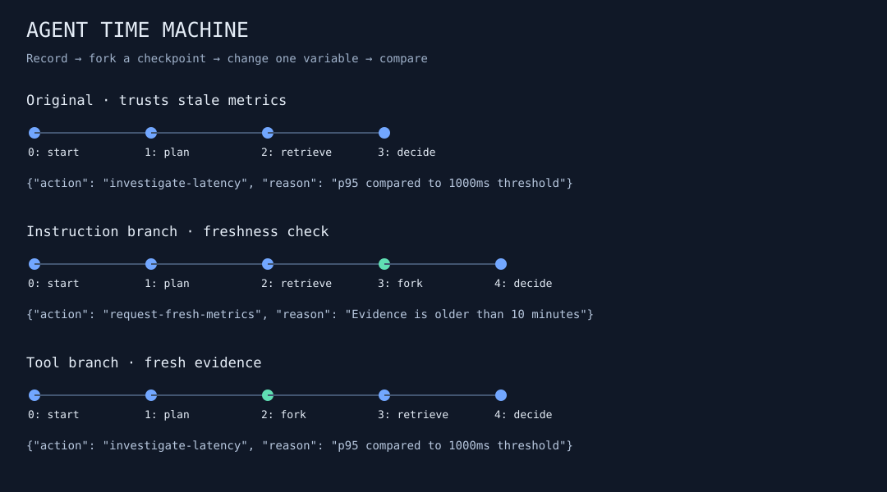

# Agent Time Machine

**Rewind an agent run. Change one decision. Keep the evidence.**

An incident agent acts on stale metrics. Was the mistake caused by its instructions,
its tool output, or both? Agent Time Machine records the run, forks at a checkpoint,
reuses the unchanged prefix, and shows exactly which state changed.



**Python 3.11+ · SQLite event store · no runtime dependencies · framework-independent**

## Try it

```bash
git clone https://github.com/dev2solid/agent-time-machine.git
cd agent-time-machine
python3 -m agent_time_machine demo --out runs/demo
python3 -m unittest discover -s tests -v
```

Open `runs/demo/timeline.svg` for the visual comparison. `comparison.json` contains
branch IDs and structural diffs. Each run also gets a full JSON event export.
The fixture is deterministic incident triage; it makes no model or external tool calls.

## What the demo proves

| Branch | Checkpoint reused | Change | Decision |
|---|---|---|---|
| Original | None | Trust returned metrics | Investigate latency using 180-minute-old data |
| Instruction branch | Through retrieval | Require evidence younger than 10 minutes | Request fresh metrics |
| Tool branch | Before retrieval | Fresh tool data + freshness instruction | Investigate using 3-minute-old data |

The instruction branch changes one variable. The tool branch changes two and is not
presented as a causal ablation of the tool alone. Nothing is deployed or restarted.

## Record your own workflow

```python
from agent_time_machine.store import Store, Session

store = Store("runs/my-agent.db")
try:
    run = store.create("Search experiment", {"retrieval_limit": 3})
    session = Session(store, run)
    # Replace these operations with your model or tool callbacks.
    session.step("retrieve", lambda state: {"documents": ["A", "B"]})
    session.step("answer", lambda state: {
        "text": "Two documents found.",
        "sources": state["steps"]["retrieve"]["documents"],
    })
    print(run, store.replay(run))
finally:
    store.close()
```

Callbacks receive reconstructed state and return JSON-serializable outputs. Calling
an already completed step returns the recorded value without calling the operation.
The library is provider-independent: use any callable model/tool client. There is no
bundled live-model client or claim of measured model improvement.

## Fork and compare

Replace `RUN_ID` with an ID printed by the demo:

```bash
python3 -m agent_time_machine replay --db runs/demo/history.db RUN_ID
python3 -m agent_time_machine fork --db runs/demo/history.db RUN_ID \
  --through 2 --instruction verify-freshness --execute-demo
python3 -m agent_time_machine compare --db runs/demo/history.db ORIGINAL_ID BRANCH_ID
python3 -m agent_time_machine export --db runs/demo/history.db ORIGINAL_ID BRANCH_ID \
  --out runs/comparison.svg
```

Checkpoint numbers are event sequence numbers, inclusive. `start` is event 0;
`plan`, `retrieve`, and `decide` are events 1–3 in the original demo. Fork before a
step to recompute it. Changing a tool after its recorded result does **not** magically
invalidate that earlier result. The explicit cutoff makes this dependency visible.

Without `--execute-demo`, the CLI only creates the branch; your application resumes
its own operations through `Session`. Replay itself never calls tools or models.

## Engineering decisions

- **Event sourcing:** replay reduces ordered events into configuration, successful steps, and error history.
- **Immutable history:** SQLite triggers reject event updates/deletions; forks copy a verified prefix and append a fork event.
- **Integrity checks:** every event links to the previous SHA-256 digest. Replay checks sequence continuity and hashes.
- **Optimistic concurrency:** appends require the expected last sequence, rejecting stale writers.
- **Structural comparison:** distinguish changed values, types, additions, and removals.
- **Portable visuals:** SVG timelines derive from recorded events and escape user-provided labels.

Read [architecture and limits](docs/architecture.md) and [the interview walkthrough](docs/walkthrough.md).

## Boundaries worth knowing

This is a local developer tool, not a distributed execution engine. An operation may
finish externally before its event commits; a process crash in that window can cause
it to execute again. Use idempotency keys for side-effecting callbacks. There is no
exactly-once claim for external tools.

The hash chain detects accidental changes and edits that do not recompute hashes;
a database administrator can remove triggers and rewrite the entire chain. It is not
a signed audit log. Recorded outputs may contain sensitive application data: choose
what your callbacks return and keep private run databases out of version control.

Built with AI assistance. The included demo and tests are reproducible; production
readiness and live-model performance are not claimed. MIT licensed.
