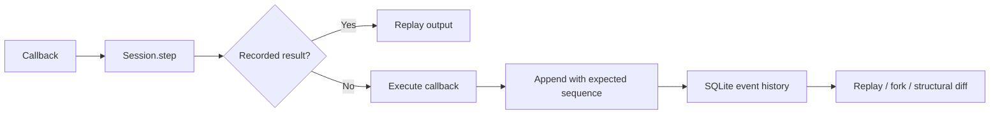

# Architecture

`Store` persists run metadata and ordered events. A run records its parent and fork
sequence. Each event contains a kind, JSON payload, sequence number, previous hash,
and hash over those values. `Session` is the application-facing recording adapter.

## Branch semantics

A fork copies the prefix through an explicit sequence into a new run in one SQLite
transaction. This makes each branch independently replayable and avoids recursive
parent traversal. The cost is O(prefix length) storage per branch. The original run
is never rewritten. Config overrides are recorded as a new fork event.

There is no automatic dependency graph: applications choose the cutoff. If an earlier
successful step depended on a changed configuration value, fork before that step.
Reusing stable step names within a run is part of the API contract. Names should not
be reused for different operations.

## Failure semantics

Callback exceptions append an error type, not the potentially sensitive exception
message, then propagate. Errors do not create a successful checkpoint. A subsequent
call can retry the step. Successful output must serialize to strict JSON; NaN and
non-JSON objects fail before being recorded.

Callbacks execute outside the write transaction. An expected-sequence comparison
prevents a stale writer from silently overwriting a newer history. It cannot stop
both concurrent callbacks from performing an external side effect before one append
fails. A queue, lease, or provider idempotency key is needed for that use case.

SQLite WAL supports readers during writes. This prototype targets one developer on
one host, not multi-region operation. There is no authentication or network server.

## Verification

Tests cover prefix preservation, changed instruction and tool outcomes, no-call
replay, error recovery, process restart, invalid checkpoints, stale append rejection,
immutability triggers, integrity checking, typed diffs, and safe SVG serialization.

Next useful extensions: content-addressed deduplication of branch prefixes, a replay
adapter for streamed provider events, sensitive-field redaction, and explicit
operation dependency metadata for automatic invalidation.
